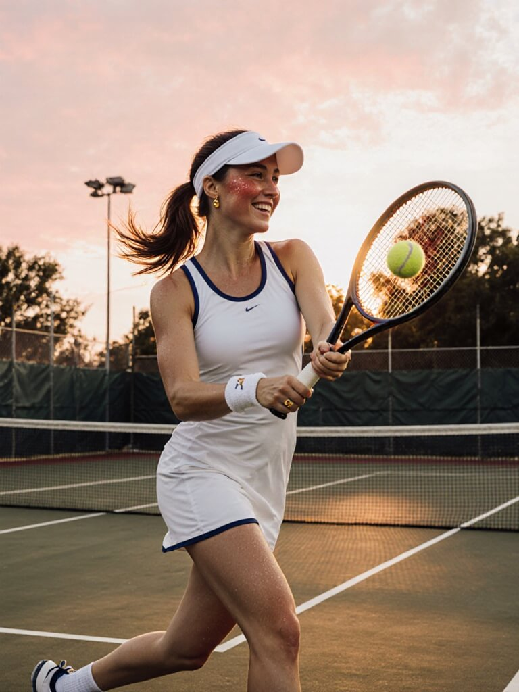
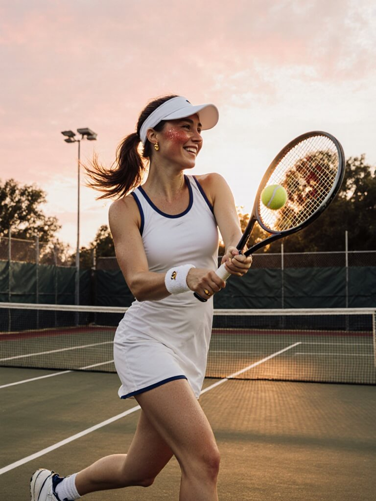

# Side-by-side: TeaCache off and on

Every picture on this page is the same scene: a woman mid-swing on a tennis court at sunset, one seed, one model at a time. Column A is plain mflux. Column B is the same model wrapped with mlx-teacache. Look at the finished image first, then open a model's page for the step-by-step preview sheets that show which steps got skipped.

Each pair comes from one cold generation per condition, run in its own process, with the model weights and the prompt already loaded before the clock starts. A small preview decoder renders every step so you can watch the image form, and that decoding time is counted in both A's and B's numbers below (each block also shows the speedup with the preview time left out). These are single-run timings, not averages: every model links its own multi-run bench report for the steadier number.

## Test machine

<!-- COMPARISON:machine START -->
Apple M1 Max, 32 GB unified memory, macOS 27.0, Python 3.12.12.
<!-- COMPARISON:machine END -->

> A beautiful young woman plays tennis on an outdoor hard court at sunset. She is caught just after a forehand, racket following through across her body, ponytail swinging, weight on her front foot. Her face shows focused, joyful determination: flushed cheeks, bright eyes, a light sheen of sweat on her forehead and temples. She wears a fitted white tennis dress with navy trim, a white visor, a terry wristband, small gold stud earrings, and white tennis shoes with navy laces. The green court's painted white lines lead back to a chain-link fence, the net, and silhouetted trees against an orange-pink sky. Low, warm sunlight rakes across the court, casting long soft shadows and a golden rim light on her hair. A yellow tennis ball hangs in the air just off the racket strings. The mood is cozy, warm and nostalgic. Photorealistic, full-frame camera, 85mm lens, shallow depth of field, natural skin texture, sharp focus on her face.

Seed 42 for every model. Qwen-Image appends its vendor's suggested suffix, `, Ultra HD, 4K, cinematic composition.`, to this prompt.

## FLUX.1 [dev]

<!-- COMPARISON:flux1-dev:summary START -->
|  | A: TeaCache off | B: TeaCache on |
|---|---|---|
| Image |  |  |
| Generation | 237.9 s · peak 14.7 GiB | 190.7 s · peak 15.4 GiB · 5 of 25 steps skipped |

On this run: 1.25× faster (1.25× with preview decoding left out) · SSIM 0.84 · multi-run measurement: [bench report](_artifacts/v0.10.0_bench_flux1_dev.json) · [More details →](docs/comparison/flux1-dev.md)
<!-- COMPARISON:flux1-dev:summary END -->

The multi-run bench ([footnote ¹](README.md#benchmarks)) measured this variant's 1.57× speedup as all step-skipping. FLUX.1 has no compiled prediction step, so there's no compile effect to separate out.

## FLUX.1 Krea [dev]

<!-- COMPARISON:flux1-krea-dev:summary START -->
|  | A: TeaCache off | B: TeaCache on |
|---|---|---|
| Image |  |  |
| Generation | 263.4 s · peak 15.4 GiB | 162.2 s · peak 15.4 GiB · 11 of 28 steps skipped |

On this run: 1.62× faster (1.64× with preview decoding left out) · SSIM 0.87 · multi-run measurement: [bench report](_artifacts/v0.11.0_bench_krea_dev.json) · [More details →](docs/comparison/flux1-krea-dev.md)
<!-- COMPARISON:flux1-krea-dev:summary END -->

[Footnote ⁸](README.md#benchmarks) credits nearly all of this variant's 1.62× multi-run speedup, about 1.57×, to skipped steps. FLUX.1 has no compiled prediction step to avoid, so the small remainder is run-to-run noise.

## FLUX.2 [klein] base 4B

<!-- COMPARISON:klein-base-4b:summary START -->
|  | A: TeaCache off | B: TeaCache on |
|---|---|---|
| Image |  |  |
| Generation | 477.5 s · peak 9.4 GiB | 398.8 s · peak 8.7 GiB · 9 of 50 steps skipped |

On this run: 1.20× faster (1.20× with preview decoding left out) · SSIM 0.94 · multi-run measurement: [bench report](_artifacts/v0.10.0_bench_klein_base_4b.json) · [More details →](docs/comparison/klein-base-4b.md)
<!-- COMPARISON:klein-base-4b:summary END -->

At its matching 512² recipe, [footnote ⁴](README.md#benchmarks) splits this variant's 1.22× multi-run speedup into 1.20× from skipped steps and a noise-level 1.01× from avoiding a compiled step. Plain mflux runs FLUX.2 Klein's prediction step compiled; the wrapper runs it eagerly instead.

## Z-Image

<!-- COMPARISON:z-image-base:summary START -->
|  | A: TeaCache off | B: TeaCache on |
|---|---|---|
| Image |  |  |
| Generation | 524.4 s · peak 13.2 GiB | 376.4 s · peak 13.5 GiB · 16 of 50 steps skipped |

On this run: 1.39× faster (1.40× with preview decoding left out) · SSIM 0.93 · multi-run measurement: [bench report](_artifacts/v0.10.0_bench_z_image.json) · [More details →](docs/comparison/z-image-base.md)
<!-- COMPARISON:z-image-base:summary END -->

[Footnote ⁶](README.md#benchmarks) measured this variant's 1.31× multi-run speedup as entirely step-skipping: running with the gate off timed at vanilla speed. That multi-run bench, at 512² with the weights loaded lazily, also reports a peak-memory drop from running eagerly instead of compiled. It doesn't show up on this run, where the weights are evaluated before generation starts, so A and B peak within about a gigabyte of each other here (13.2 GiB vs 13.5 GiB).

## FLUX.2 [klein] base 9B

<!-- COMPARISON:klein-base-9b:summary START -->
|  | A: TeaCache off | B: TeaCache on |
|---|---|---|
| Image |  |  |
| Generation | 1025.6 s · peak 8.5 GiB | 810.5 s · peak 8.7 GiB · 11 of 50 steps skipped |

On this run: 1.27× faster (1.27× with preview decoding left out) · SSIM 0.86 · multi-run measurement: [bench report](_artifacts/v0.10.0_bench_klein_base_9b.json) · [More details →](docs/comparison/klein-base-9b.md)
<!-- COMPARISON:klein-base-9b:summary END -->

At its matching 512² recipe, [footnote ⁵](README.md#benchmarks) splits this variant's 1.37× multi-run speedup into 1.34× from skipped steps and a small 1.02× from avoiding a compiled step. Plain mflux runs this model's prediction step compiled; the wrapper runs it eagerly instead. That same footnote also reports a peak-memory drop from about 22 GB to 9.5 GB at that recipe; it doesn't show up on this run, where the weights are evaluated before generation and the text encoder is freed once the prompt is encoded, so A and B peak within about a gigabyte of each other here (8.5 GiB vs 8.7 GiB).

## Qwen-Image

<!-- COMPARISON:qwen-image:summary START -->
|  | A: TeaCache off | B: TeaCache on |
|---|---|---|
| Image |  |  |
| Generation | 693.6 s · peak 17.6 GiB | 336.7 s · peak 17.6 GiB · 26 of 50 steps skipped |

On this run: 2.06× faster (2.10× with preview decoding left out) · SSIM 0.92 · multi-run measurement: [bench report](_artifacts/v0.11.0_bench_qwen_image.json) · [More details →](docs/comparison/qwen-image.md)
<!-- COMPARISON:qwen-image:summary END -->

[Footnote ⁷](README.md#benchmarks) measured this variant's 2.68× multi-run speedup as step-skipping: mflux doesn't compile Qwen's prediction step, and the no-gate wrapper's 1.04× over vanilla sits inside the spread between vanilla reps, so there's no compile effect to separate out.

## Distilled Klein vs Base Klein

Base Klein with TeaCache is not a substitute for the distilled model on speed alone, but it is the model to reach for when you need guidance, negative prompts, or a fine-tune the distilled model cannot run. The [distilled-vs-base study](docs/comparison/klein-distilled-vs-base.md) runs all three side by side, distilled, base, and base with TeaCache, and has the numbers.

## What is excluded and why

This page skips two kinds of runs. `flux1-schnell` and the distilled FLUX.2 Klein variants (4B and 9B) finish in four to eight steps, too few for the gate to find any pair of steps alike enough to skip, so TeaCache buys nothing there and only adds its own small per-step check. FLUX.2 Klein base without guidance (`guidance=1.0`) is a similar non-case: the base model needs classifier-free guidance to look right, so a no-guidance run is a misuse of the model, not a fair comparison.

## Reproduce

Every run on this page used mflux 0.20.0 in a Python 3.12 environment; this repository's own lock resolves an older mflux, so set one up on its own:

```bash
uv venv --python 3.12
uv pip install "mflux==0.20.0" "mlx-taef==0.8.3" scikit-image -e .
```

The worker subprocesses run offline, so download every checkpoint first — `hf download black-forest-labs/FLUX.1-dev`, `hf download black-forest-labs/FLUX.1-Krea-dev`, `hf download black-forest-labs/FLUX.2-klein-base-4B`, `hf download Tongyi-MAI/Z-Image`, `hf download black-forest-labs/FLUX.2-klein-base-9B`, and `hf download Qwen/Qwen-Image`. Three of those sit behind the FLUX Non-Commercial click-through — FLUX.1 [dev], FLUX.1 Krea [dev], and FLUX.2 [klein] base 9B — so accept the license on each model's Hugging Face page before downloading it.

Each model takes one command to check memory where its recipe needs it, two more to run condition A and then B, and a last one to merge the pair into a report entry and build the step sheets:

```bash
uv run python scripts/bench_comparison.py --probe --only <slug>            # only for slugs with a memory fallback
uv run python scripts/bench_comparison.py --probe --fallback --only <slug> # only if the probe above fails
uv run python scripts/bench_comparison.py --only <slug> --max-workers 1    # runs once for A, again for B
uv run python scripts/bench_comparison.py --only <slug> --max-workers 1
uv run python scripts/bench_comparison.py --only <slug> --finalize         # SSIM, contact sheets, report entry
```

Replace `<slug>` with one of `flux1-dev`, `flux1-krea-dev`, `klein-base-4b`, `z-image-base`, `klein-base-9b`, `qwen-image`; only `klein-base-9b` and `qwen-image` carry a memory fallback, so the probe lines only apply to those two. On this machine the A-plus-B pair took roughly 7 minutes for either FLUX.1 model, 15 minutes for klein-base-4b or z-image-base, 17 minutes for qwen-image, and half an hour for klein-base-9b, almost all of it generation time. Each model's own page has the exact seconds.

The worker subprocesses write their raw PNGs and preview frames to this repository's ignored test-artifacts folder, not tracked in git. The JPGs on this page are compressed copies of those raw outputs, so SSIM was measured on the lossless PNGs before compression, not on what you're looking at here.

---

By Denis Ineshin · [ineshin.space](https://ineshin.space)
