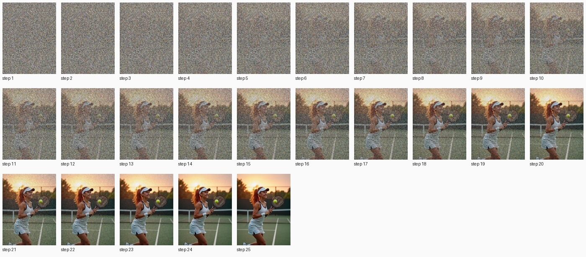
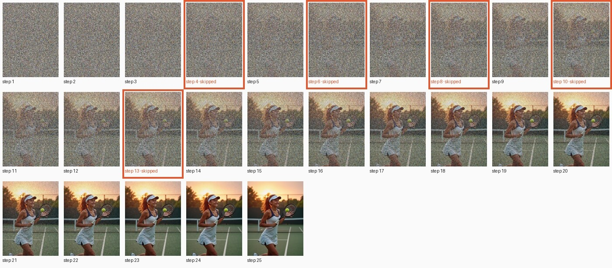

# FLUX.1 [dev]

[← Comparison](../../COMPARISON.md)

25 steps, guidance 3.5, q4, 768×1024, seed 42.

## Prompt

> A beautiful young woman plays tennis on an outdoor hard court at sunset. She is caught just after a forehand, racket following through across her body, ponytail swinging, weight on her front foot. Her face shows focused, joyful determination: flushed cheeks, bright eyes, a light sheen of sweat on her forehead and temples. She wears a fitted white tennis dress with navy trim, a white visor, a terry wristband, small gold stud earrings, and white tennis shoes with navy laces. The green court's painted white lines lead back to a chain-link fence, the net, and silhouetted trees against an orange-pink sky. Low, warm sunlight rakes across the court, casting long soft shadows and a golden rim light on her hair. A yellow tennis ball hangs in the air just off the racket strings. The mood is cozy, warm and nostalgic. Photorealistic, full-frame camera, 85mm lens, shallow depth of field, natural skin texture, sharp focus on her face.

<!-- COMPARISON:flux1-dev:sheets START -->
**A: TeaCache off**, every step in order



**B: TeaCache on**, skipped steps framed in orange


<!-- COMPARISON:flux1-dev:sheets END -->

<!-- COMPARISON:flux1-dev:details START -->
|  | A: TeaCache off | B: TeaCache on |
|---|---|---|
| Model load (weights evaluated) | 7.7 s | 8.0 s |
| Prompt encoding | 0.8 s | 0.9 s |
| Generation, wall clock | 237.9 s | 190.7 s |
| Median computed step | 9.2 s | 9.3 s |
| Median skipped step | — | 0.0 s |
| Preview decoding, total | 3.9 s | 3.7 s |
| Steps computed / skipped | 25 / 0 | 20 / 5 |
| Skip pattern (S = skipped) | — | `CCCSCSCSCSCCSCCCCCCCCCCCC` |
| Threshold (rel_l1) | — | 0.20 |
| MLX peak: load / encode / generation | 3.3 GiB / 9.5 GiB / 14.7 GiB | 3.3 GiB / 9.5 GiB / 15.4 GiB |
| MLX active + cache, peak | 15.8 GiB | 16.3 GiB |
| Process footprint (macOS), peak | 16.9 GiB | 17.7 GiB |
Speedup on this run: 1.25× wall clock, 1.25× with preview decoding left out, 1.26× per step after the first. SSIM of B against A: 0.843, measured on the lossless outputs.

Recipe: 25 steps, guidance 3.5, q4, 768×1024, seed 42. Checkpoint `black-forest-labs/FLUX.1-dev`; preview decoder `taef1`. mlx-teacache 0.11.1, mflux 0.20.0, MLX 0.32.2, mlx-taef 0.8.3. Multi-run measurement of this model: [bench report](../../_artifacts/v0.10.0_bench_flux1_dev.json).
<!-- COMPARISON:flux1-dev:details END -->

### Notes

The committed multi-run bench (footnote ¹ in the README) measured this variant's 1.57× combined speedup as all step-skipping, across three cold reps. mflux has no compiled prediction step for FLUX.1 to avoid, so a session where the no-gate wrapper timed 1.11× ahead of vanilla was just run-to-run spread, not a second speedup mechanism, the same as footnote ⁸ found for Krea. FLUX.1's CLIP-L text encoder reads only the first 77 tokens of a prompt, while T5 reads the whole thing, so CLIP-L never sees most of this scene's roughly 170 words.

On this run the gate skips five steps, landing at steps 4, 6, 8, 10 and 13, never two in a row. The pose and scene stay the same between A and B, but B redraws some details: the hand near the ball opens instead of gripping the racket, and the wristband visible in A is gone from B's wrist. That kind of local redraw is what pulls the SSIM down to 0.84 even though the two read as the same shot. Both A and B carry a small sportswear logo on the visor and top that the model added on its own, a habit of the model, not something TeaCache does.

### Reproduce

```bash
uv run python scripts/bench_comparison.py --only flux1-dev --max-workers 1
uv run python scripts/bench_comparison.py --only flux1-dev --max-workers 1
uv run python scripts/bench_comparison.py --only flux1-dev --finalize
```
