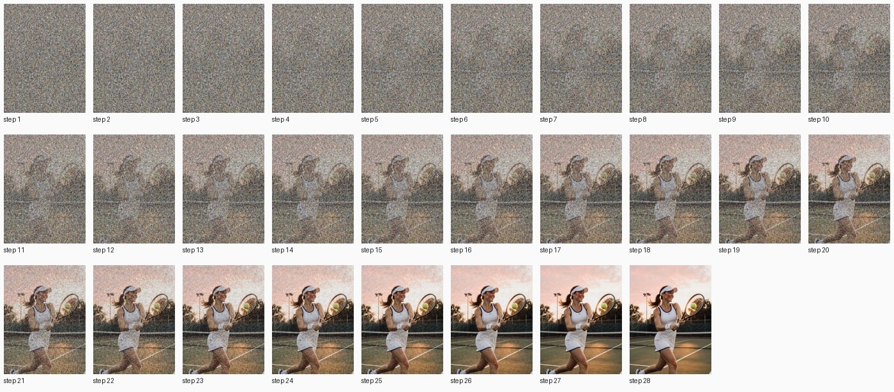
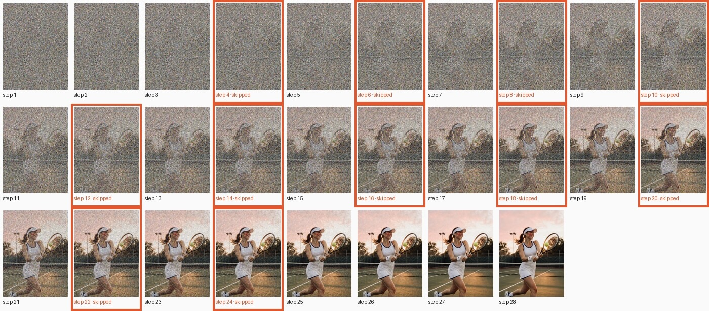

# FLUX.1 Krea [dev]

[← Comparison](../../COMPARISON.md)

28 steps, guidance 4.5, q4, 768×1024, seed 42.

## Prompt

> A beautiful young woman plays tennis on an outdoor hard court at sunset. She is caught just after a forehand, racket following through across her body, ponytail swinging, weight on her front foot. Her face shows focused, joyful determination: flushed cheeks, bright eyes, a light sheen of sweat on her forehead and temples. She wears a fitted white tennis dress with navy trim, a white visor, a terry wristband, small gold stud earrings, and white tennis shoes with navy laces. The green court's painted white lines lead back to a chain-link fence, the net, and silhouetted trees against an orange-pink sky. Low, warm sunlight rakes across the court, casting long soft shadows and a golden rim light on her hair. A yellow tennis ball hangs in the air just off the racket strings. The mood is cozy, warm and nostalgic. Photorealistic, full-frame camera, 85mm lens, shallow depth of field, natural skin texture, sharp focus on her face.

<!-- COMPARISON:flux1-krea-dev:sheets START -->
**A: TeaCache off**, every step in order



**B: TeaCache on**, skipped steps framed in orange


<!-- COMPARISON:flux1-krea-dev:sheets END -->

<!-- COMPARISON:flux1-krea-dev:details START -->
|  | A: TeaCache off | B: TeaCache on |
|---|---|---|
| Model load (weights evaluated) | 7.6 s | 7.6 s |
| Prompt encoding | 0.9 s | 0.8 s |
| Generation, wall clock | 263.4 s | 162.2 s |
| Median computed step | 9.2 s | 9.2 s |
| Median skipped step | — | 0.0 s |
| Preview decoding, total | 4.1 s | 4.0 s |
| Steps computed / skipped | 28 / 0 | 17 / 11 |
| Skip pattern (S = skipped) | — | `CCCSCSCSCSCSCSCSCSCSCSCSCCCC` |
| Threshold (rel_l1) | — | 0.30 |
| MLX peak: load / encode / generation | 3.3 GiB / 9.5 GiB / 15.4 GiB | 3.3 GiB / 9.5 GiB / 15.4 GiB |
| MLX active + cache, peak | 16.5 GiB | 16.4 GiB |
| Process footprint (macOS), peak | 17.1 GiB | 17.4 GiB |

Speedup on this run: 1.62× wall clock, 1.64× with preview decoding left out, 1.68× per step after the first. SSIM of B against A: 0.875, measured on the lossless outputs.

Recipe: 28 steps, guidance 4.5, q4, 768×1024, seed 42. Checkpoint `black-forest-labs/FLUX.1-Krea-dev`; preview decoder `taef1`. mlx-teacache 0.11.1 with this branch's changes (commit `bcaac6f`), mflux 0.20.0, MLX 0.32.2, mlx-taef 0.8.3. Multi-run measurement of this model: [bench report](../../_artifacts/v0.11.0_bench_krea_dev.json).
<!-- COMPARISON:flux1-krea-dev:details END -->

### Notes

Footnote ⁸ credits about 1.57× of this variant's 1.62× multi-run speedup to skipped steps. FLUX.1 has no compiled prediction step to avoid, so the small remainder above that figure is run-to-run noise, not compile avoidance. Like FLUX.1 [dev], Krea's CLIP-L text encoder reads only the first 77 prompt tokens, while T5 reads the whole prompt.

On this run the gate skips 11 of 28 steps, alternating from step 4 through step 24. A and B read as close to the same photo: the ball sits a touch differently in the air and one court line shifts slightly, and little else moves. The model again drew its own sportswear logo on the visor and top in both frames, on its own.

### Reproduce

```bash
uv run python scripts/bench_comparison.py --only flux1-krea-dev --max-workers 1
uv run python scripts/bench_comparison.py --only flux1-krea-dev --max-workers 1
uv run python scripts/bench_comparison.py --only flux1-krea-dev --finalize
```
