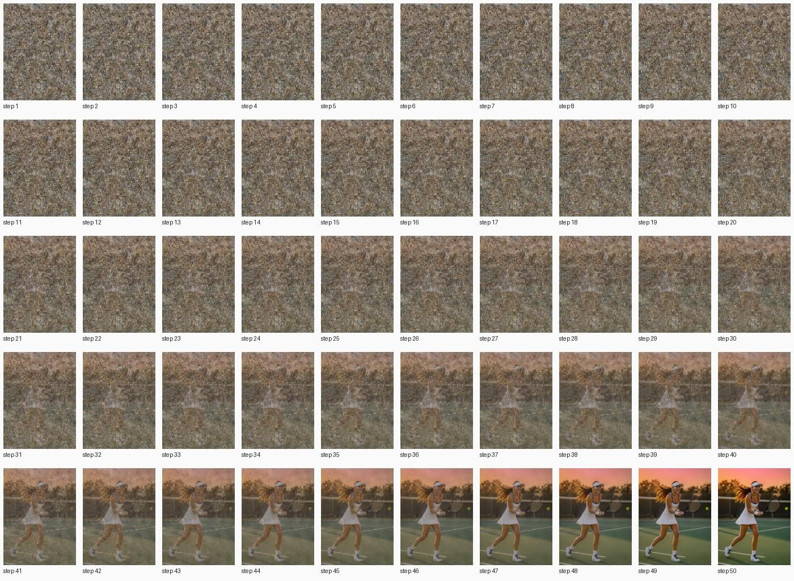
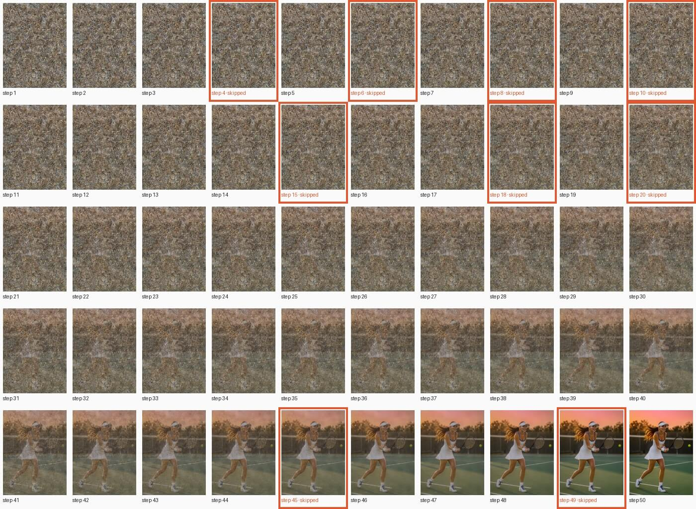

# FLUX.2 [klein] base 4B

[← Comparison](../../COMPARISON.md)

50 steps, guidance 4.0, q4, 768×1024, seed 42.

## Prompt

> A beautiful young woman plays tennis on an outdoor hard court at sunset. She is caught just after a forehand, racket following through across her body, ponytail swinging, weight on her front foot. Her face shows focused, joyful determination: flushed cheeks, bright eyes, a light sheen of sweat on her forehead and temples. She wears a fitted white tennis dress with navy trim, a white visor, a terry wristband, small gold stud earrings, and white tennis shoes with navy laces. The green court's painted white lines lead back to a chain-link fence, the net, and silhouetted trees against an orange-pink sky. Low, warm sunlight rakes across the court, casting long soft shadows and a golden rim light on her hair. A yellow tennis ball hangs in the air just off the racket strings. The mood is cozy, warm and nostalgic. Photorealistic, full-frame camera, 85mm lens, shallow depth of field, natural skin texture, sharp focus on her face.

<!-- COMPARISON:klein-base-4b:sheets START -->
**A: TeaCache off**, every step in order



**B: TeaCache on**, skipped steps framed in orange


<!-- COMPARISON:klein-base-4b:sheets END -->

<!-- COMPARISON:klein-base-4b:details START -->
|  | A: TeaCache off | B: TeaCache on |
|---|---|---|
| Model load (weights evaluated) | 5.0 s | 4.9 s |
| Prompt encoding | 1.2 s | 1.2 s |
| Generation, wall clock | 477.5 s | 398.8 s |
| Median computed step | 9.4 s | 9.5 s |
| Median skipped step | — | 0.0 s |
| Preview decoding, total | 7.6 s | 7.3 s |
| Steps computed / skipped | 50 / 0 | 41 / 9 |
| Skip pattern (S = skipped) | — | `CCCSCSCSCSCCCCSCCSCSCCCCCCCCCCCCCCCCCCCCCCCCSCCCSC` |
| Threshold (rel_l1) | — | 0.17 |
| MLX peak: load / encode / generation | 2.9 GiB / 5.0 GiB / 9.4 GiB | 2.9 GiB / 5.0 GiB / 8.7 GiB |
| MLX active + cache, peak | 9.8 GiB | 9.8 GiB |
| Process footprint (macOS), peak | 11.8 GiB | 10.9 GiB |
Speedup on this run: 1.20× wall clock, 1.20× with preview decoding left out, 1.21× per step after the first. SSIM of B against A: 0.945, measured on the lossless outputs.

Recipe: 50 steps, guidance 4.0, q4, 768×1024, seed 42. Checkpoint `black-forest-labs/FLUX.2-klein-base-4B`; preview decoder `taef2`. mlx-teacache 0.11.1, mflux 0.20.0, MLX 0.32.2, mlx-taef 0.8.3. Multi-run measurement of this model: [bench report](../../_artifacts/v0.10.0_bench_klein_base_4b.json).
<!-- COMPARISON:klein-base-4b:details END -->

### Notes

At its matching 512² recipe, footnote ⁴ splits this variant's 1.22× multi-run speedup into 1.20× from skipped steps and a noise-level 1.01× from avoiding a compiled step. Plain mflux runs FLUX.2 Klein base 4B's prediction step compiled; the wrapper runs it eagerly instead, which is also where the memory numbers below come from, not from the gate.

On this run the gate skips 9 of 50 steps, most of them in the first third of the schedule. A and B read as the same photograph, down to the shoes and laces.

### Reproduce

```bash
uv run python scripts/bench_comparison.py --only klein-base-4b --max-workers 1
uv run python scripts/bench_comparison.py --only klein-base-4b --max-workers 1
uv run python scripts/bench_comparison.py --only klein-base-4b --finalize
```
