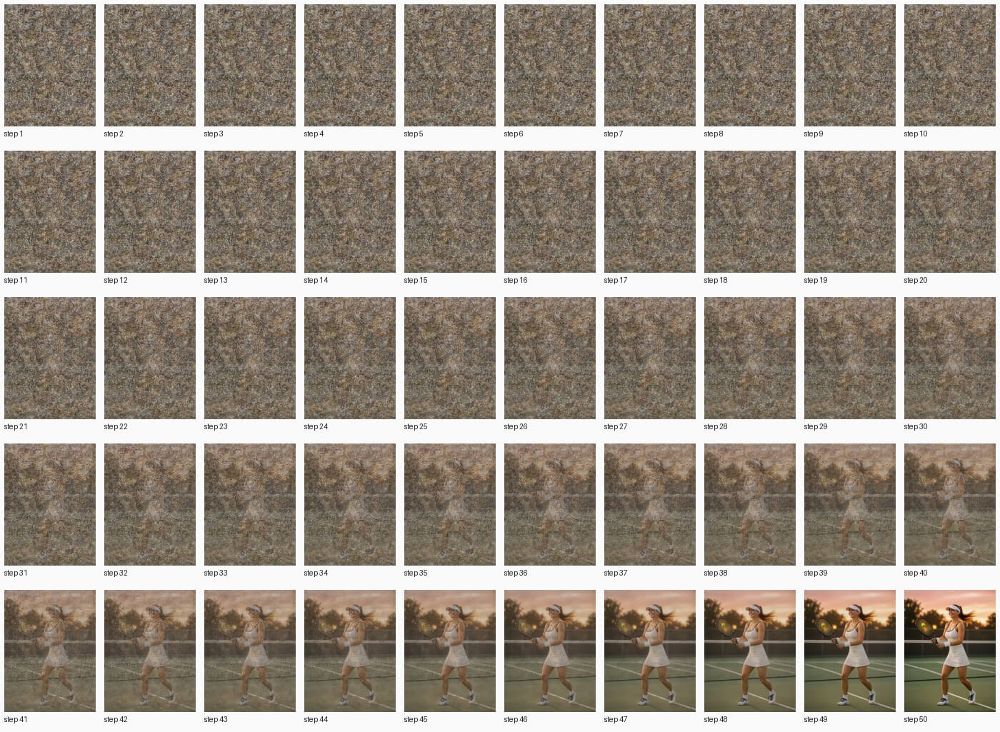
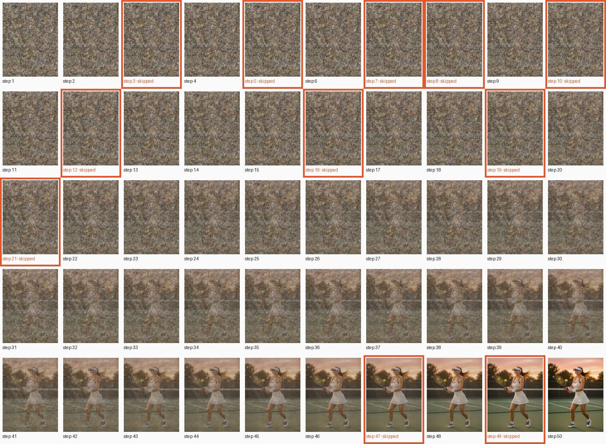

# FLUX.2 [klein] base 4B

[← Comparison](../../COMPARISON.md)

## Prompt

<!-- COMPARISON:klein-base-4b:prompt START -->
> A beautiful young woman plays tennis on an outdoor hard court at sunset. She is caught just after a forehand, racket following through across her body, ponytail swinging, weight on her front foot. Her face shows focused, joyful determination: flushed cheeks, bright eyes, a light sheen of sweat on her forehead and temples. She wears a fitted white tennis dress with navy trim, a white visor, a terry wristband, small gold stud earrings, and white tennis shoes with navy laces. The green court's painted white lines lead back to a chain-link fence, the net, and silhouetted trees against an orange-pink sky. Low, warm sunlight rakes across the court, casting long soft shadows and a golden rim light on her hair. A yellow tennis ball hangs in the air just off the racket strings. The mood is cozy, warm and nostalgic. Photorealistic, full-frame camera, 85mm lens, shallow depth of field, natural skin texture, sharp focus on her face.

Seed 42, 50 steps, guidance 4.0, q8, 864×1152.
<!-- COMPARISON:klein-base-4b:prompt END -->

<!-- COMPARISON:klein-base-4b:sheets START -->
**A: TeaCache off**, every step in order



**B: TeaCache on**, skipped steps framed in orange


<!-- COMPARISON:klein-base-4b:sheets END -->

<!-- COMPARISON:klein-base-4b:details START -->
|  | A: TeaCache off | B: TeaCache on |
|---|---|---|
| Model load (weights evaluated) | 6.2 s | 6.5 s |
| Prompt encoding | 1.2 s | 1.2 s |
| Generation, wall clock | 612.6 s | 483.9 s |
| Median computed step | 11.9 s | 12.1 s |
| Median skipped step | — | 0.0 s |
| Preview decoding, total | 10.4 s | 9.4 s |
| Steps computed / skipped | 50 / 0 | 39 / 11 |
| Skip pattern (S = skipped) | — | `CCSCSCSSCSCSCCCSCCSCSCCCCCCCCCCCCCCCCCCCCCCCCCSCSC` |
| Threshold (rel_l1) | — | 0.17 |
| MLX peak: encoders loaded / prompt encoded + model loaded / generation | 4.4 GiB / 8.3 GiB / 14.7 GiB | 4.5 GiB / 8.3 GiB / 12.5 GiB |
| MLX active + cache, peak | 15.5 GiB | 13.4 GiB |
| Process footprint (macOS), peak | 16.9 GiB | 15.0 GiB |

Speedup on this run: 1.27× wall clock, 1.27× with preview decoding left out, 1.28× per step after the first. SSIM of B against A: 0.940, measured on the lossless outputs.

Recipe: 50 steps, guidance 4.0, q8, 864×1152, seed 42. Checkpoint `black-forest-labs/FLUX.2-klein-base-4B`; preview decoder `taef2`. mlx-teacache 0.11.1 (harness at commit `3b6f5e0`), mflux 0.20.0, MLX 0.32.2, mlx-taef 0.8.3. Multi-run measurement of this model: [bench report](../../_artifacts/v0.12.0_bench_klein_base_4b.json).
<!-- COMPARISON:klein-base-4b:details END -->

### Notes

At its matching 512² recipe, footnote ³ splits this variant's 1.20× multi-run speedup (measured with 0.12.0) into 1.18× from skipped steps and a noise-level 1.01× from avoiding a compiled step. Plain mflux runs FLUX.2 Klein base 4B's prediction step compiled; the wrapper runs it eagerly instead. This run didn't include a no-gate condition, so the MLX peak-generation difference below (14.7 GiB vs 12.5 GiB) can't be pinned on the eager path versus the gate.

On this run the gate skips 11 of 50 steps, most of them in the first half of the schedule. The scene holds, down to the shoes and laces, but two things change in B: she squints with her eyes nearly closed, and a second ball appears beside the racket. Both come from steps skipped at the library's default threshold (0.17), which is what this page shows.

This run used mlx-teacache 0.11.1. From 0.12.0 the gate no longer skips a step whose input change is smaller than anything in its calibration. A replay of this run's gate predicts one fewer skip (10 of 50) with 0.12.0, and several of the early skips land a step later, so B would come out slightly different.

### Reproduce

```bash
uv run --no-sync python scripts/bench_comparison.py --only klein-base-4b --max-workers 1
uv run --no-sync python scripts/bench_comparison.py --only klein-base-4b --max-workers 1
uv run --no-sync python scripts/bench_comparison.py --only klein-base-4b --finalize --export-jpg
uv run --no-sync python docs/_generate_comparison.py --write
```

Run every command with `--no-sync` so uv leaves the environment from the
[main Reproduce section](../../COMPARISON.md#reproduce) as it is. The
published JPGs went through an additional image optimiser after `--export-jpg` wrote them, so a
reproduction's JPGs differ in size from the committed ones even though they show the same pixels.
