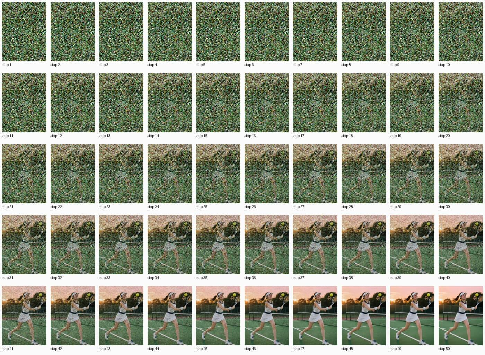
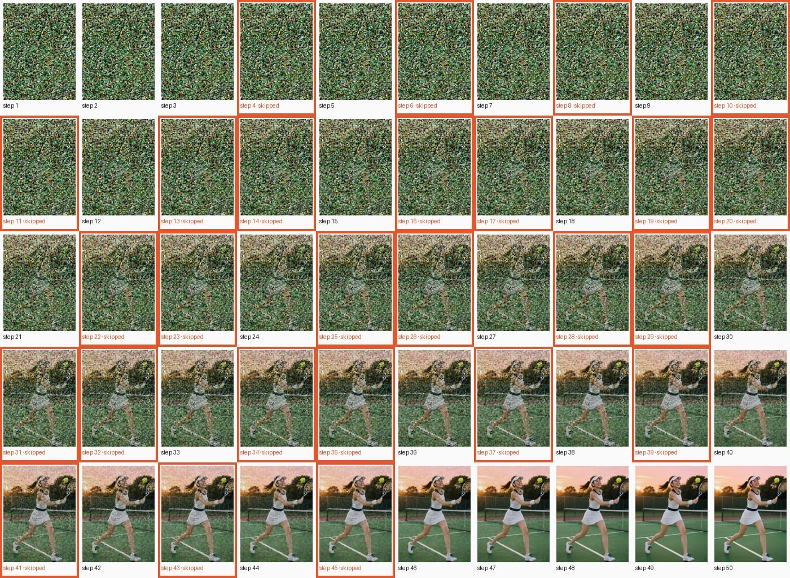

# Qwen-Image

[← Comparison](../../COMPARISON.md)

50 steps, guidance 4.0, q4, 672×896, seed 42; text encoder freed once the prompt is encoded.

This page loads the original `Qwen/Qwen-Image` checkpoint by its full name: from mflux 0.19 on, the `qwen-image` alias resolves to a newer checkpoint instead.

## Prompt

> A beautiful young woman plays tennis on an outdoor hard court at sunset. She is caught just after a forehand, racket following through across her body, ponytail swinging, weight on her front foot. Her face shows focused, joyful determination: flushed cheeks, bright eyes, a light sheen of sweat on her forehead and temples. She wears a fitted white tennis dress with navy trim, a white visor, a terry wristband, small gold stud earrings, and white tennis shoes with navy laces. The green court's painted white lines lead back to a chain-link fence, the net, and silhouetted trees against an orange-pink sky. Low, warm sunlight rakes across the court, casting long soft shadows and a golden rim light on her hair. A yellow tennis ball hangs in the air just off the racket strings. The mood is cozy, warm and nostalgic. Photorealistic, full-frame camera, 85mm lens, shallow depth of field, natural skin texture, sharp focus on her face., Ultra HD, 4K, cinematic composition.

<!-- COMPARISON:qwen-image:sheets START -->
**A: TeaCache off**, every step in order



**B: TeaCache on**, skipped steps framed in orange


<!-- COMPARISON:qwen-image:sheets END -->

<!-- COMPARISON:qwen-image:details START -->
|  | A: TeaCache off | B: TeaCache on |
|---|---|---|
| Model load (weights evaluated) | 11.0 s | 11.3 s |
| Prompt encoding | 1.0 s | 1.0 s |
| Generation, wall clock | 693.6 s | 336.7 s |
| Median computed step | 13.4 s | 13.3 s |
| Median skipped step | — | 0.0 s |
| Preview decoding, total | 13.3 s | 12.5 s |
| Steps computed / skipped | 50 / 0 | 24 / 26 |
| Skip pattern (S = skipped) | — | `CCCSCSCSCSSCSSCSSCSSCSSCSSCSSCSSCSSCSCSCSCSCSCCCCC` |
| Threshold (rel_l1) | — | 0.30 |
| MLX peak: load / encode / generation | 13.2 GiB / 13.4 GiB / 17.6 GiB | 13.2 GiB / 13.4 GiB / 17.6 GiB |
| MLX active + cache, peak | 17.3 GiB | 17.9 GiB |
| Process footprint (macOS), peak | 17.7 GiB | 18.2 GiB |

Speedup on this run: 2.06× wall clock, 2.10× with preview decoding left out, 2.15× per step after the first. SSIM of B against A: 0.916, measured on the lossless outputs.

Recipe: 50 steps, guidance 4.0, q4, 672×896, seed 42, text encoder freed once the prompt is encoded. Checkpoint `Qwen/Qwen-Image`; preview decoder `qwen-image`. mlx-teacache 0.11.1 with this branch's changes (commit `8c3fff5`), mflux 0.20.0, MLX 0.32.2, mlx-taef 0.8.3. Multi-run measurement of this model: [bench report](../../_artifacts/v0.11.0_bench_qwen_image.json).
<!-- COMPARISON:qwen-image:details END -->

### Notes

Footnote ⁷ in the README measured this variant's 2.68× multi-run speedup as step-skipping: mflux doesn't compile Qwen's prediction step, so there's no compile effect to separate out. The no-gate wrapper's 1.04× there sits inside the spread between vanilla reps, closer to noise than to a second mechanism.

On this run the gate skips 26 of 50 steps. Unlike the other models on this page, a few of those skips come two in a row through the middle of the schedule, though never more than two consecutive. A and B keep the same player, pose, sun and court; B redraws the court lines and drops the second net post behind her. The stock 4-bit build leaves a light speckle, sweat-like texture on her shoulder, not the heavier grain the variant page describes at its default recipe.

### Reproduce

```bash
uv run python scripts/bench_comparison.py --probe --only qwen-image
uv run python scripts/bench_comparison.py --probe --fallback --only qwen-image
uv run python scripts/bench_comparison.py --only qwen-image --max-workers 1
uv run python scripts/bench_comparison.py --only qwen-image --max-workers 1
uv run python scripts/bench_comparison.py --only qwen-image --finalize
```
