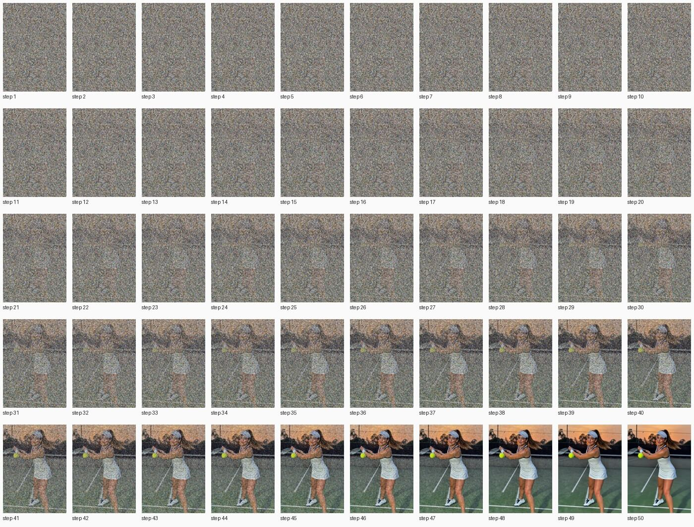
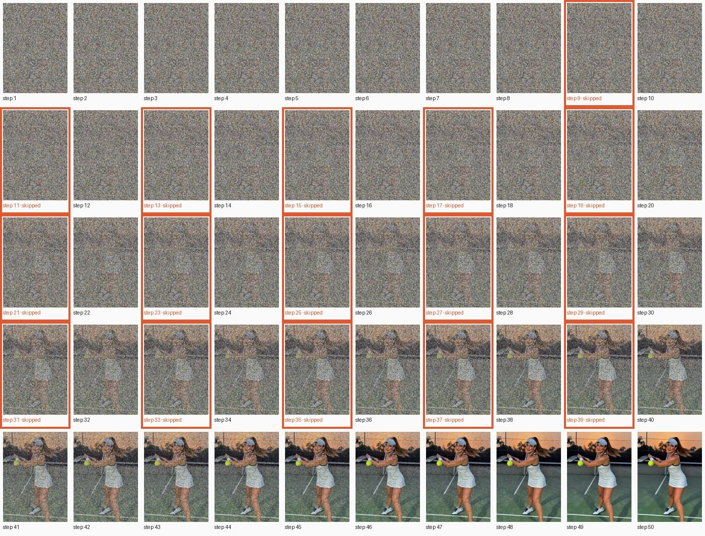

# Z-Image

[← Comparison](../../COMPARISON.md)

50 steps, guidance 4.0, q8, 640×896, seed 42.

## Prompt

> A beautiful young woman plays tennis on an outdoor hard court at sunset. She is caught just after a forehand, racket following through across her body, ponytail swinging, weight on her front foot. Her face shows focused, joyful determination: flushed cheeks, bright eyes, a light sheen of sweat on her forehead and temples. She wears a fitted white tennis dress with navy trim, a white visor, a terry wristband, small gold stud earrings, and white tennis shoes with navy laces. The green court's painted white lines lead back to a chain-link fence, the net, and silhouetted trees against an orange-pink sky. Low, warm sunlight rakes across the court, casting long soft shadows and a golden rim light on her hair. A yellow tennis ball hangs in the air just off the racket strings. The mood is cozy, warm and nostalgic. Photorealistic, full-frame camera, 85mm lens, shallow depth of field, natural skin texture, sharp focus on her face.

<!-- COMPARISON:z-image-base:sheets START -->
**A: TeaCache off**, every step in order



**B: TeaCache on**, skipped steps framed in orange


<!-- COMPARISON:z-image-base:sheets END -->

<!-- COMPARISON:z-image-base:details START -->
|  | A: TeaCache off | B: TeaCache on |
|---|---|---|
| Model load (weights evaluated) | 7.0 s | 7.0 s |
| Prompt encoding | 1.3 s | 1.3 s |
| Generation, wall clock | 524.4 s | 376.4 s |
| Median computed step | 10.4 s | 10.5 s |
| Median skipped step | — | 0.8 s |
| Preview decoding, total | 5.4 s | 5.5 s |
| Steps computed / skipped | 50 / 0 | 34 / 16 |
| Skip pattern (S = skipped) | — | `CCCCCCCCSCSCSCSCSCSCSCSCSCSCSCSCSCSCSCSCCCCCCCCCCC` |
| Threshold (rel_l1) | — | 0.12 |
| MLX peak: load / encode / generation | 4.5 GiB / 10.4 GiB / 13.2 GiB | 4.5 GiB / 10.4 GiB / 13.5 GiB |
| MLX active + cache, peak | 14.1 GiB | 14.3 GiB |
| Process footprint (macOS), peak | 15.8 GiB | 15.4 GiB |

Speedup on this run: 1.39× wall clock, 1.40× with preview decoding left out, 1.41× per step after the first. SSIM of B against A: 0.934, measured on the lossless outputs.

Recipe: 50 steps, guidance 4.0, q8, 640×896, seed 42. Checkpoint `Tongyi-MAI/Z-Image`; preview decoder `zimage`. mlx-teacache 0.11.1 with this branch's changes (commit `bcaac6f`), mflux 0.20.0, MLX 0.32.2, mlx-taef 0.8.3. Multi-run measurement of this model: [bench report](../../_artifacts/v0.10.0_bench_z_image.json).
<!-- COMPARISON:z-image-base:details END -->

### Notes

Footnote ⁶ measured this variant's 1.31× multi-run speedup as entirely step-skipping: the wrapper timed at vanilla speed with the gate turned off, so avoiding a compiled step buys nothing here on wall clock. That multi-run bench, at 512² with the weights loaded lazily, also reports a peak-memory drop from running eagerly instead of compiled. It doesn't show up on this run, where the weights are evaluated before generation, so A and B peak within about a gigabyte of each other in the table above (13.2 GiB vs 13.5 GiB).

On this run the gate skips 16 of 50 steps, alternating through the middle of the schedule. The composition holds, but B adds a palm tree at the top left that isn't in A, and the net post shifts a little. Z-Image renders at 640×896 in 8-bit weights, its pinned recipe, so the images on this page are smaller than the other models'.

### Reproduce

```bash
uv run python scripts/bench_comparison.py --only z-image-base --max-workers 1
uv run python scripts/bench_comparison.py --only z-image-base --max-workers 1
uv run python scripts/bench_comparison.py --only z-image-base --finalize
```
