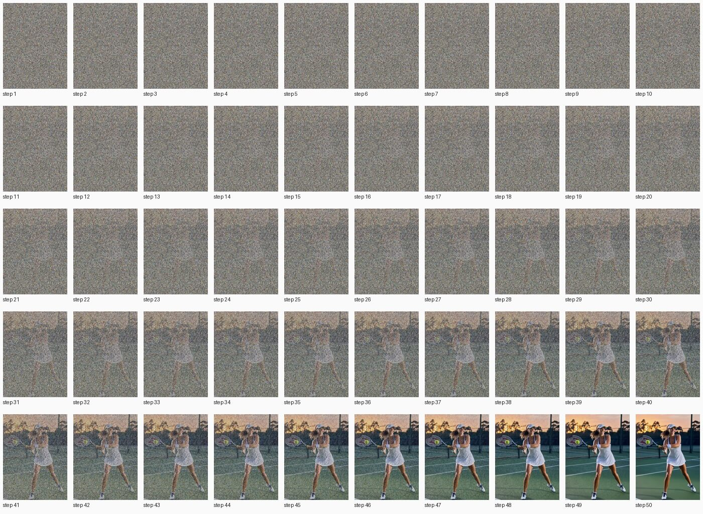
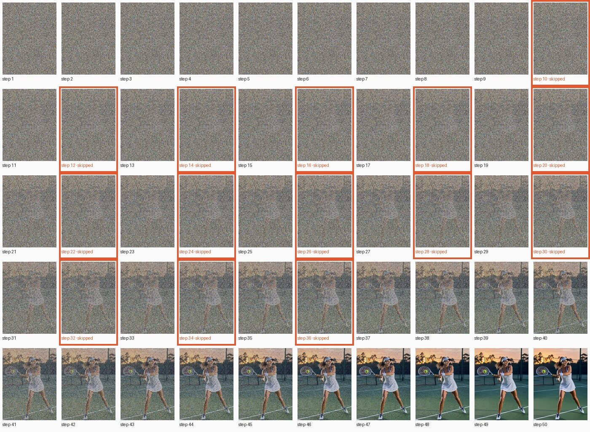

# Z-Image

[← Comparison](../../COMPARISON.md)

## Prompt

<!-- COMPARISON:z-image-base:prompt START -->
> A beautiful young woman plays tennis on an outdoor hard court at sunset. She is caught just after a forehand, racket following through across her body, ponytail swinging, weight on her front foot. Her face shows focused, joyful determination, with bright eyes, a natural warm glow on her cheeks and a faint dewy sheen on her skin. She wears a fitted white tennis dress with navy trim, a white visor, a terry wristband, small gold stud earrings, and white tennis shoes with navy laces. The green court's painted white lines lead back to a chain-link fence, the net, and silhouetted trees against an orange-pink sky. Low, warm sunlight rakes across the court, casting long soft shadows and a golden rim light on her hair. A yellow tennis ball hangs in the air just off the racket strings. The mood is cozy, warm and nostalgic. Photorealistic, full-frame camera, 85mm lens, shallow depth of field, natural skin texture with fine pores, sharp focus on her face.

Negative prompt:

> blotchy skin, red patches on the cheeks, white specks on the skin, distorted face, asymmetric eyes, blurry, plastic skin, waxy skin, oversharpened, extra fingers, deformed hands, artifacts

Seed 42, 50 steps, guidance 4.0, q8, 864×1152.
<!-- COMPARISON:z-image-base:prompt END -->

<!-- COMPARISON:z-image-base:sheets START -->
**A: TeaCache off**, every step in order



**B: TeaCache on**, skipped steps framed in orange


<!-- COMPARISON:z-image-base:sheets END -->

<!-- COMPARISON:z-image-base:details START -->
|  | A: TeaCache off | B: TeaCache on |
|---|---|---|
| Model load (weights evaluated) | 13.0 s | 7.7 s |
| Prompt encoding | 1.4 s | 1.4 s |
| Generation, wall clock | 1024.5 s | 767.3 s |
| Median computed step | 20.2 s | 20.3 s |
| Median skipped step | — | 1.6 s |
| Preview decoding, total | 9.4 s | 9.0 s |
| Steps computed / skipped | 50 / 0 | 36 / 14 |
| Skip pattern (S = skipped) | — | `CCCCCCCCCSCSCSCSCSCSCSCSCSCSCSCSCSCSCCCCCCCCCCCCCC` |
| Threshold (rel_l1) | — | 0.12 |
| MLX peak: encoders loaded / prompt encoded + model loaded / generation | 4.5 GiB / 10.4 GiB / 14.7 GiB | 4.4 GiB / 10.4 GiB / 14.7 GiB |
| MLX active + cache, peak | 15.8 GiB | 15.6 GiB |
| Process footprint (macOS), peak | 16.9 GiB | 16.7 GiB |

Speedup on this run: 1.34× wall clock, 1.34× with preview decoding left out, 1.35× per step after the first. SSIM of B against A: 0.854, measured on the lossless outputs.

Recipe: 50 steps, guidance 4.0, q8, 864×1152, seed 42. Checkpoint `Tongyi-MAI/Z-Image`; preview decoder `zimage`. mlx-teacache 0.11.1 (harness at commit `964a1e1`), mflux 0.20.0, MLX 0.32.2, mlx-taef 0.8.3. Multi-run measurement of this model: [bench report](../../_artifacts/v0.10.0_bench_z_image.json).
<!-- COMPARISON:z-image-base:details END -->

### Notes

Footnote ⁵ measured this variant's 1.31× multi-run speedup as entirely step-skipping: the wrapper timed at vanilla speed with the gate turned off, so avoiding a compiled step buys nothing here on wall clock. That multi-run bench, at 512² with the weights loaded lazily, also reports a peak-memory drop from running eagerly instead of compiled. It doesn't show up on this run, where the weights are evaluated before generation, so A and B both peak at 14.7 GiB in the table above.

On this run the gate skips 14 of 50 steps, alternating through the middle of the schedule. Pose, racket, ball and court stay put. B turns her head a little further toward the camera and laughs wider, and the court lines by her feet shift; those changes are most of why SSIM lands at 0.85.

This model runs its own wording of the scene, shown above with its negative prompt. With the shared prompt, Z-Image drew "flushed cheeks" and "a light sheen of sweat on her forehead" as red patches and white specks on her face, and they got worse with TeaCache on. The softer wording and the negative prompt clear both, with TeaCache off and on. The image size also went up, from 640×896 to 864×1152 (about one megapixel).

### Reproduce

```bash
uv run --no-sync python scripts/bench_comparison.py --only z-image-base --max-workers 1
uv run --no-sync python scripts/bench_comparison.py --only z-image-base --max-workers 1
uv run --no-sync python scripts/bench_comparison.py --only z-image-base --finalize --export-jpg
uv run --no-sync python docs/_generate_comparison.py --write
```

Run every command with `--no-sync`: plain `uv run` re-syncs to this repository's own lock file, which can
downgrade mlx underneath the venv the [main Reproduce section](../../COMPARISON.md#reproduce) sets up. The
published JPGs went through an additional image optimiser after `--export-jpg` wrote them, so a
reproduction's JPGs differ in size from the committed ones even though they show the same pixels.
